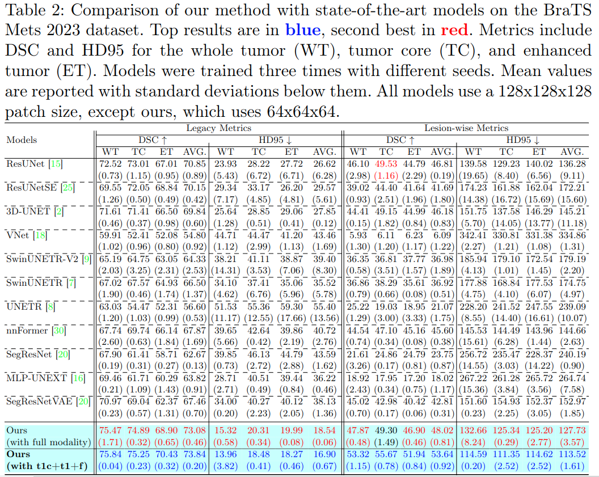

# Segmentation of Brain Metastases in MRI: A Two-Stage Deep Learning Approach with Modality Impact Study <br> <span style="float: right"><sub><sup>MICCAI 2024 PRIME Workshop</sub></sup></span>
[](https://arxiv.org/abs/2407.14011)

This is the official repository of the paper titled "Segmentation of Brain Metastases in MRI: A Two-Stage Deep Learning Approach with Modality Impact Study" which introduces two-stage deep learning approach for brain metastasis segmentation.

> Yousef Sadegheih and Dorit Merhof

## Abstract

> Brain metastasis segmentation poses a significant challenge in medical imaging due to the complex presentation and variability in size and location of metastases. In this study, we first investigate the impact of different imaging modalities on segmentation performance using a 3D U-Net. Through a comprehensive analysis, we determine that combining all available modalities does not necessarily enhance performance. Instead, the combination of T1-weighted with contrast enhancement (T1c), T1-weighted (T1), and FLAIR modalities yields superior results. Building on these findings, we propose a two-stage detection and segmentation model specifically designed to accurately segment brain metastases. Our approach demonstrates that leveraging three key modalities (T1c, T1, and FLAIR) achieves significantly higher accuracy compared to single-pass deep learning models. This targeted combination allows for precise segmentation, capturing even small metastases that other models often miss. Our model sets a new benchmark in brain metastasis segmentation, highlighting the importance of strategic modality selection and multi-stage processing in medical imaging.

## Key Contributions

- **Modality impact study**: We conduct a comprehensive evaluation of various MRI modalities to assess their impact on segmentation performance.
- **Two-stage deep learning framework**: We propose a two-stage segmentation approach that separates the detection of metastasis-containing patches from the segmentation of metastases within these patches, aiming to improve segmentation accuracy and efficiency using just three modalities instead of four modalities.
- **Supriority over single-pass deep learning models**: We provide a detailed comparison with state-of-the-art single-pass segmentation models, demonstrating the advantages of our method in handling small and heterogeneous brain metastases.

## Workflow

The first stage detects regions with potential metastases, and the second stage segments these regions. Below, we explain each stage in more detail.

<p align="center">
  
</p>

*For a detailed explanation of each component, please refer to our paper.*

## Datasets

Our experiments were conducted on [BraTS-Mets 2023](https://www.synapse.org/Synapse:syn51156910/wiki/622553) where it showed that our two-stage model is performing much better than the single-pass models

<p align="center">
  
</p>

<p align="center">
  
</p>

## Getting Started

This section provides instructions on how to run our two-stage deep learning model for brain metastasis segmentation task.

### Requirements
  - Ubuntu 16.04 or higher
  - CUDA 12.x
  - Python v3.7 or higher
  - Pytorch v2.x
  - Pytorch-lightning 2.x
  - Hardware Spec
    - GPU with 8GB memory or larger capacity
    - _For our experiments, we used 1GPU(A100-80G)_

Install the required packages:

```bash
pip install -r requirements.txt
```
### Training

First the detector has to be trained.
```bash
python src/main.py -c densenet121
```
**Before running the code above please adjust the config's paths.** 

Then when the training of the detector is finished you should train the segmentor by
```bash
python src/main.py -c unet_detect_seg
```
**Before running the code above please adjust the config's paths.** 

### Inference
For inference you need to have your final weights for detector and segmentor and make sure in the config file `unet_detect_seg` you set the `test_mode` variable to `true` and give the path to the model you want to test in the `ckpt_path`. 
```bash
python src/main.py -c unet_detect_seg
```

### Pre-trained weights

You can download the learned weights for the segmentor and detector for both full modality and (t1c,t1,flair).
   Modality   | Segmentor         | Detector
  -----------|----------------|----------------
   Full Modality  | [[Download](https://myfiles.uni-regensburg.de/filr/public-link/file-download/0447879c90b809a80190bbf452df0f6b/120822/-2821463328806488135/segmentor_weight%20%28full%20modality%29.ckpt)]| [[Download](https://myfiles.uni-regensburg.de/filr/public-link/file-download/0447879c90b809a80190bbf45b1d0f6f/120821/-4880761362689834300/detector_weight%20%28full%20modality%29.ckpt)] 
   (t1c,t1,flair)       | [[Download](https://myfiles.uni-regensburg.de/filr/public-link/file-download/0447879c90b809a80190baf8143304d2/120763/-7398472434594936298/segmentor_weight.ckpt)]| [[Download](https://myfiles.uni-regensburg.de/filr/public-link/file-download/0447879c90b809a80190baf80a4804ce/120764/-5549921760222123808/detector_weight.ckpt)] 


## Citation

If you find this work useful for your research, please cite:

```bibtex
@article{sadegheih2024metseg,
  title={Segmentation of Brain Metastases in MRI: A Two-Stage Deep Learning Approach with Modality Impact Study},
  author={Sadegheih, Yousef and Merhof, Dorit},
  booktitle={Predictive Intelligence in Medicine},
  year={2024},
  organization={Springer Nature Switzerland}
}
